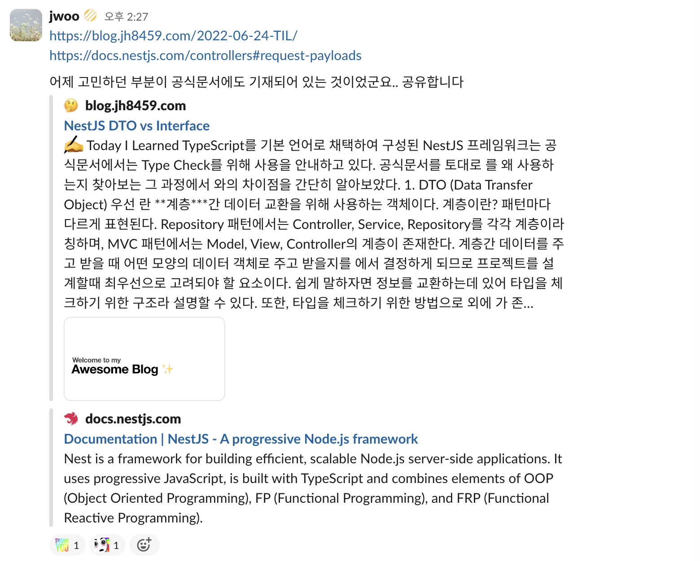
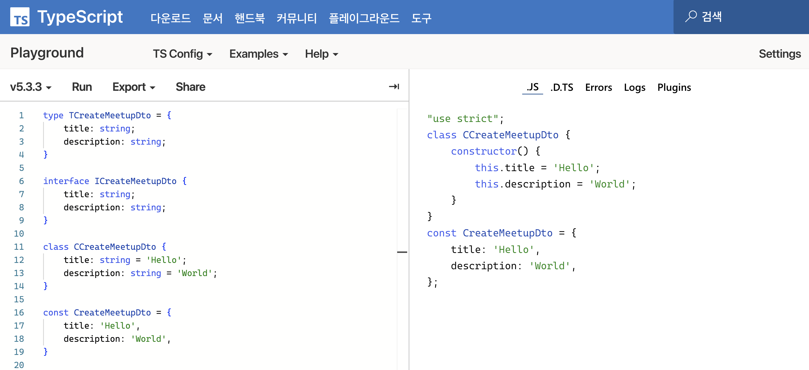

## 의문점 🤔

TypeScript와 NestJS로 개발하던 도중, 문득 그런 의문이 들었다.

_'DTO(Data Transfer Object)는 왜 class로 구현하는걸까..?'_

그저 타입 체크를 위해서라면 interface나 type으로도 가능한게 아닌가?<br/>
그런데 왜 많은 레퍼런스에서, 그리고 공식 문서에서도 class로 DTO를 구현하는 걸까?

<br /><br />

## 💡 궁금증 해결..!

의외로 궁금증은 빠르게 해결할 수 있었다.. <br/>
심지어 공식 문서에 기재 되어 있던 내용이었던 것...

> [NestJS DTO vs Interface](https://blog.jh8459.com/2022-06-24-TIL)<br/>
[NestJS 공식문서 - Controllers - Request payloads](https://docs.nestjs.com/controllers#request-payloads)



> But first (if you use TypeScript), we need to determine the DTO (Data Transfer Object) schema.
A DTO is an object that defines how the data will be sent over the network.
We could determine the DTO schema by using TypeScript interfaces, or by simple classes.
Interestingly, we recommend using classes here. Why?
Classes are part of the JavaScript ES6 standard, and therefore they are preserved as real entities in the compiled JavaScript.
On the other hand, since TypeScript interfaces are removed during the transpilation, Nest can't refer to them at runtime.
This is important because features such as Pipes enable additional possibilities when they have access to the metatype of the variable at runtime.
<br /><br />TypeScript를 사용하는 경우 DTO 스키마를 결정해야 합니다. DTO는 네트워크를 통해 데이터가 전송되는 방법을 정의하는 개체입니다.
TypeScript Interface나 간단한 class를 사용하여 DTO 스키마를 결정할 수 있습니다.
흥미롭게도 이 상황에서는 class를 사용하는 것이 좋습니다.
class는 JavaScript ES6 표준의 일부이므로 JavaScript로 컴파일해도 실제 객체로 남아있지만, TypeScript interface는 변환 중에 제거되므로 Nest가 런타임에 interface를 참조할 수 없기 때문입니다.
Pipe와 같은 기능은 런타임에 변수의 메타타입에 접근할 수 있을 때 유용하므로, 런타임 시 참조 가능 여부는 중요합니다.
<br /><br />출처: [NestJS 공식 문서](https://docs.nestjs.com/controllers#request-payloads)

<br />

class는 컴파일 이후에도 남아있어 런타임에도 참조할 수 있다는 점이 DTO를 class로 구현하는 핵심적인 이유였다.<br/>
DTO는 데이터 전송에 쓰는 객체인 만큼 데이터 타입이나 값에 대한 유효성 검사를 수행하는 경우가 많은데, 이를 위해서는 런타임에도 DTO에 접근할 수 있어야한다...!

<br />

```typescript
export class CreateMeetupDto {
  @ApiProperty({
    description: '이벤트 제목 (최대 50자)',
    minLength: 1,
    maxLength: 50,
  })
  @Transform((params) =>
    typeof params.value === 'string' ? params.value.trim() : params.value
  )
  @IsString()
  @IsNotEmpty()
  @MaxLength(50)
  title: string;

  @ApiProperty({
    description: '이벤트 설명 (최대 255자)',
    minLength: 1,
    maxLength: 255,
  })
  @IsString()
  @Transform((params) => params.value.trim())
  @IsNotEmpty()
  @MaxLength(255)
  description: string;
}
```

<br />

위는 내가 실제로 프로젝트에서 사용하는 DTO 중 하나다.<br/>
해당 DTO에서도 `@IsString()`, `@IsNotEmpty()`, `@MaxLength(255)` 등을 활용하여 유효성 검사를 하는 것을 볼 수 있다.

<br /><br />

## 타입과 값 구분하기
> 참고: 이펙티브 타입스크립트 - 아이템 8 타입 공간과 값 공간의 심벌 구분하기

[타입스크립트 플레이그라운드](https://www.typescriptlang.org/ko/play)는 타입스크립트 코드를 자바스크립트로 변환한 결과물을 보여준다.<br/>
컴파일 과정에서 타입은 제거되기 때문에, 사라지는 것이 있다면 타입일 것이다.



type과 interface 예약어를 이용하여 선언하면 타입이 되고, class나 const, let로 선언하면 값으로 사용할 수 있다.<br/>
특히, class와 enum은 상황에 따라 타입과 값이 전부 가능한 예약어이다.