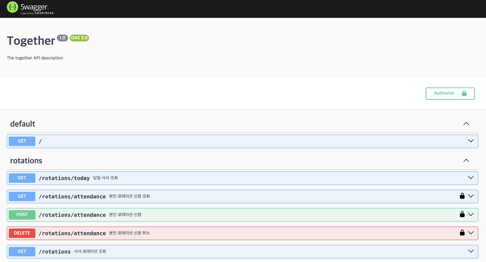

나는 swagger를 꽤 좋아하는 편이다.
<br/>귀찮은 문서 작업을 자동화해 주는 데다가, API 테스트도 쉽게 할 수 있다.
<br/>프로젝트 첫 시작에서 멈춰있게 되는 일반 문서와 달리 관리가 편하고, 프론트 분들과 협업하기 딱 맞는다는 생각이 든다.
<br/>그래서 나는 프로젝트를 시작할 때, swagger를 도입하자고 적극 주장하는 편이다.

<br/>

## 패키지 설치
```bash
yarn add @nestjs/swagger
```
이 글에서 사용하고 있는 `@nestjs/swagger` 버전은 `7.2.0` 이다.

<br/>

## NestJs 설정

### `main.ts`
```ts
import { NestFactory } from '@nestjs/core';
import { AppModule } from './app.module';
import { Logger } from '@nestjs/common';
import { DocumentBuilder, SwaggerCustomOptions, SwaggerModule } from '@nestjs/swagger';
import { ValidationPipe } from '@nestjs/common';

async function bootstrap() {
  const app = await NestFactory.create(AppModule);

  ...

  // swagger 설정
  const swaggerConfig = new DocumentBuilder()
    .setTitle('Together')
    .setDescription('The together API description')
    .setVersion('1.0')
    .addBearerAuth({
      type: 'http',
      scheme: 'bearer',
      name: 'JWT',
      in: 'header',
    })
    .build();
  const swaggerDocument = SwaggerModule.createDocument(app, swaggerConfig);
  const swaggerCustomOptions: SwaggerCustomOptions = {
    swaggerOptions: {
      persistAuthorization: true,
    },
  };
  SwaggerModule.setup('swagger', app, swaggerDocument, swaggerCustomOptions);

  const port = process.env.BACK_PORT || 9999;
  await app.listen(port);
  Logger.log(`Server running on ${port}`);
}
bootstrap();
```
<br/>

### `swaggerConfig`
```ts
const swaggerConfig = new DocumentBuilder()
  .setTitle('Together')
  .setDescription('The together API description')
  .setVersion('1.0')
  .addBearerAuth({
    type: 'http',
    scheme: 'bearer',
    name: 'JWT',
    in: 'header',
  })
  .build();
const swaggerDocument = SwaggerModule.createDocument(app, swaggerConfig);
```
`DocumentBuilder` 로 swagger 문서를 구성할 수 있고, 메서드로 기본 설정을 해줄 수 있다.
<br/>여기서 `addBearerAuth` 설정은 jwt를 이용한 api를 swagger에서 사용할 수 있게 도와준다.
<br/>그리고 `SwaggerModule` 의 `createDocument` 함수를 통해 swagger 문서를 생성하게 된다.

참고로 `DocumentBuilder` 클래스의 함수는 다음과 같다.

<br/>

### `DocumentBuilder`
```ts
import { OpenAPIObject } from './interfaces';
import { ExternalDocumentationObject, ParameterObject, SecurityRequirementObject, SecuritySchemeObject, ServerVariableObject } from './interfaces/open-api-spec.interface';
export declare class DocumentBuilder {
    private readonly logger;
    private readonly document;
    setTitle(title: string): this;
    setDescription(description: string): this;
    setVersion(version: string): this;
    setTermsOfService(termsOfService: string): this;
    setContact(name: string, url: string, email: string): this;
    setLicense(name: string, url: string): this;
    addServer(url: string, description?: string, variables?: Record<string, ServerVariableObject>): this;
    setExternalDoc(description: string, url: string): this;
    setBasePath(path: string): this;
    addTag(name: string, description?: string, externalDocs?: ExternalDocumentationObject): this;
    addExtension(extensionKey: string, extensionProperties: any): this;
    addSecurity(name: string, options: SecuritySchemeObject): this;
    addGlobalParameters(...parameters: ParameterObject[]): this;
    addSecurityRequirements(name: string | SecurityRequirementObject, requirements?: string[]): this;
    addBearerAuth(options?: SecuritySchemeObject, name?: string): this;
    addOAuth2(options?: SecuritySchemeObject, name?: string): this;
    addApiKey(options?: SecuritySchemeObject, name?: string): this;
    addBasicAuth(options?: SecuritySchemeObject, name?: string): this;
    addCookieAuth(cookieName?: string, options?: SecuritySchemeObject, securityName?: string): this;
    build(): Omit<OpenAPIObject, 'paths'>;
}
```

<br/>

### swaggerOptions
```ts
const swaggerOptions: SwaggerCustomOptions = {
  swaggerOptions: {
    persistAuthorization: true,
  },
};
```
`SwaggerCustomOptions` 는 swagger의 상세 설정을 도와준다.
<br/>`swaggerOptions: { persistAuthorization: true }` 은 BearerToken과 관련된 옵션으로, 새로고침을 해도 swagger에 저장한 BearerToken 값이 날아가지 않게 해준다.

참고로 `SwaggerCustomOptions` 인터페이스는 아래와 같다.

<br/>

### SwaggerCustomOptions
```ts
import { SwaggerUiOptions } from './swagger-ui-options.interface';
import { OpenAPIObject } from './open-api-spec.interface';
export interface SwaggerCustomOptions {
    useGlobalPrefix?: boolean;
    explorer?: boolean;
    swaggerOptions?: SwaggerUiOptions;
    customCss?: string;
    customCssUrl?: string | string[];
    customJs?: string | string[];
    customJsStr?: string | string[];
    customfavIcon?: string;
    customSwaggerUiPath?: string;
    swaggerUrl?: string;
    customSiteTitle?: string;
    validatorUrl?: string;
    url?: string;
    urls?: Record<'url' | 'name', string>[];
    jsonDocumentUrl?: string;
    yamlDocumentUrl?: string;
    patchDocumentOnRequest?: <TRequest = any, TResponse = any>(req: TRequest, res: TResponse, document: OpenAPIObject) => OpenAPIObject;
}
```


<br/>

#### createDocument & setup
```ts
SwaggerModule.setup('swagger', app, swaggerDocument, swaggerCustomOptions);
```
`SwaggerModule` 의 `setup` 함수는 swagger ui를 볼 수 있는 path를 설정해준다. 위의 코드는 `{백엔드 주소}/swagger` 로 들어가면 생성된 swagger 문서를 확인할 수 있다.



NestJS swagger는 기본적으로 Controller 기반으로 api 주소를 맵핑해준다. 하지만 그 외의 request나 response 형태는 데코레이터를 통해 추가로 설정해주어야 한다.
<br/>

### 참고
> [[Nest.js] Nest.js API 만들기 (12) - API 문서화(Swagger)](https://any-ting.tistory.com/122)
<br/> [Nestjs 에서 swagger 사용하기](https://popawaw.tistory.com/183)
<br/> [NestJS에서 Swagger를 사용하는 방법](https://jhyeok.com/nestjs-swagger/)
<br/> [NESTJS로 Swagger 문서화 하기](https://velog.io/@glowforever/NESTJS%EB%A1%9C-Swagger-%EB%AC%B8%EC%84%9C%ED%99%94-%ED%95%98%EA%B8%B0)
<br/> [Nestjs 프로젝트에 Swagger 도입하기](https://velog.io/@mhj6380/Nestjs-%ED%94%84%EB%A1%9C%EC%A0%9D%ED%8A%B8%EC%97%90-Swagger-%EB%8F%84%EC%9E%85%ED%95%98%EA%B8%B0)
<br/> [[nestjs]swagger를 이용하여 api 문서화](https://blog.naver.com/pjt3591oo/222461534913)