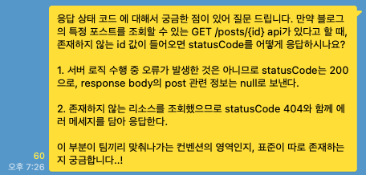
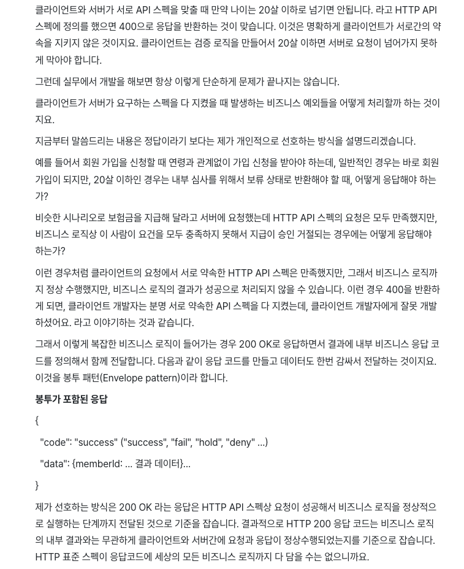
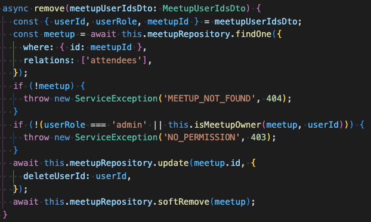
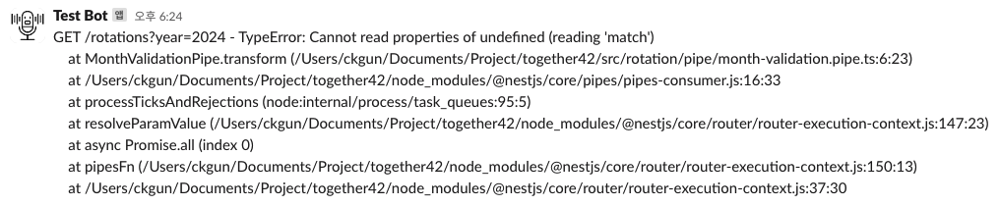

### 비즈니스 로직 에러의 응답



만약 API 스펙을 전부 맞췄지만 비즈니스 로직에서 에러가 발생한다면, 어떤 응답을 내려줘야할까요?
<br/>궁금증이 생겨 개발자들이 모인 SNS에 질문을 드렸더니 다양한 답변을 받을 수 있었습니다.

*- 케이스 바이 케이스. 맥락과 컨벤션 차이!*
<br/>*- 좀 더 효율적인 모니터링을 위해 성공(200번대) 응답을 내려준다.*
<br/>*- 정답은 없다. 리소스 관점에선 404, 서비스 관점에서는 200으로 볼 수 있다.*

그리고 인프런 질문 게시판에서도 관련된 글을 찾을 수 있었습니다.

<br/>

> **출처: [인프런 질문 게시판 - 봉투 패턴](https://www.inflearn.com/questions/111465/5xx-%EA%B4%80%EB%A0%A8-%EC%A7%88%EB%AC%B8%EC%9E%88%EC%8A%B5%EB%8B%88%EB%8B%A4)**
<br/>

이러한 고민을 하면서 한가지를 결심하게 되었습니다.

*'비즈니스 로직에서 발생하는 에러를 분리해야겠다..!'*

API 스펙과 달라 발생하는 오류와 결이 다르기도 하고, 로깅이나 모니터링 방식에 차이를 둘 수도 있기 때문입니다.
<br/>그리고 [NestJS - 효과적인 예외 핸들링](https://velog.io/@intellik/NestJS-%ED%9A%A8%EA%B3%BC%EC%A0%81%EC%9D%B8-%EC%98%88%EC%99%B8-%ED%95%B8%EB%93%A4%EB%A7%81#%EC%84%B8-%EC%A4%84-%EC%9A%94%EC%95%BD)에서 비즈니스 로직 에러를 분리하는 것이 결합도를 낮추고 단일 책임 원칙도 준수할 수 있는 방법이라고 소개합니다.

<br/>

### ServiceException

먼저, 비즈니스 로직 발생 시 사용할 `ServiceException`을 만들어 줍니다.
<br/>`ServiceException`은 `Error`를 상속받아 만들었고, 저의 경우 `HttpException`과 유사하게 만들었습니다.

```ts
export enum ErrorMessage {
  NO_PERMISSION = '권한이 없습니다.',
  MEETUP_NOT_FOUND = '존재하지 않는 이벤트입니다.',
  MEETUP_NOT_FOUND_OR_CLOSED = '존재하지 않거나 마감된 이벤트입니다.',
  MEETUP_REGISTRATION_NOT_FOUND = '해당 이벤트에 신청한 내역이 없습니다.',
  MEETUP_REGISTRATION_ALREADY_EXIST = '이미 신청한 이벤트 입니다.',
  TOO_MANY_MEETUP_TEAM_NUMBER = '신청 인원보다 팀 개수가 많습니다.',

  USER_NOT_FOUND = '존재하지 않는 유저입니다.',

  HASH_TOKEN_ERROR = 'HASH_TOKEN_ERROR'
}

export type KeyOfErrorMessage = keyof typeof ErrorMessage;
```

```ts
import { ErrorMessage, KeyOfErrorMessage } from '../enum/error-message.enum';

export class ServiceException extends Error {
  private readonly status: number;
  private readonly errorCode: string;

  constructor(errorCode: KeyOfErrorMessage, status: number, message?: string) {
    super(message || ErrorMessage[errorCode]);
    this.name = errorCode;
    this.status = status;
    this.errorCode = errorCode;
  }

  getStatus() {
    return this.status;
  }

  getErrorCode() {
    return this.errorCode;
  }

  getMessage() {
    return this.message;
  }
}
```
>특정 이벤트를 삭제하는 API에서 ServiceException 사용하기
<br/>

<br/>

### ServiceExceptionFilter

`ServiceException` 발생시 잡아줄 `ExceptionFilter`도 하나 만들어야합니다.
`@Catch(ServiceException)` 데코레이터를 사용하여 `ServiceException` 만 잡아내는 `ServiceExceptionFilter` 를 만들 수 있으며, 응답을 변경할 수도 있습니다.

```ts
import { ArgumentsHost, Catch, ExceptionFilter, Logger } from '@nestjs/common';
import { ServiceException } from '../exception/service.exception';

@Catch(ServiceException)
export class ServiceExceptionFilter implements ExceptionFilter {
  private readonly logger = new Logger(ServiceExceptionFilter.name);

  catch(exception: ServiceException, host: ArgumentsHost) {
    const ctx = host.switchToHttp();
    const response = ctx.getResponse();
    const status = exception.getStatus();

    response.status(status).json({
      statusCode: status,
      errorCode: exception.getErrorCode(),
      message: exception.getMessage(),
    });
  }
}

```

<br/><br/>

### LogInterceptor

추가로 저는 에러 로깅을 하기 위한 `Interceptor`도 하나 구현했습니다.
<br/>내가 예상하지 못한 에러인 경우 슬랙으로 에러 내용을 전송합니다!
<br/>다만 에러 로깅의 경우 로깅의 책임이 에러 필터에 있는지, 인터셉터에 있는지는 좀 더 고민해보려 합니다.

```ts
import {
  CallHandler,
  ExecutionContext,
  HttpException,
  Injectable,
  Logger,
  NestInterceptor,
} from '@nestjs/common';
import { Observable, catchError } from 'rxjs';
import { ServiceException } from '../exception/service.exception';
import { UnknownException } from '../exception/unknown.exception';
import { SlackService } from 'nestjs-slack';
import { Message } from 'slack-block-builder';
import { ConfigService } from '@nestjs/config';

@Injectable()
export class LogInterceptor implements NestInterceptor {
  private readonly logger = new Logger(LogInterceptor.name);

  constructor(
    private slackService: SlackService,
    private configService: ConfigService,
  ) {}

  intercept(context: ExecutionContext, next: CallHandler<any>): Observable<any> {
    const request = context.switchToHttp().getRequest();

    return next.handle().pipe(
      catchError((err) => {
        const log = `${request.method} ${request.url} - ${err.stack}`;
        this.logger.error(log);
        if (err instanceof ServiceException || err instanceof HttpException) {
          throw err;
        }
        this.slackService.postMessage(
          Message({
            text: log,
            channel: this.configService.get('slack.jiphyeonjeonChannel'),
          }).buildToObject(),
        );
        throw new UnknownException(err);
      }),
    );
  }
}
```


<br/>

### 출처

> [NestJS - 효과적인 예외 핸들링](https://velog.io/@intellik/NestJS-%ED%9A%A8%EA%B3%BC%EC%A0%81%EC%9D%B8-%EC%98%88%EC%99%B8-%ED%95%B8%EB%93%A4%EB%A7%81#%EC%84%B8-%EC%A4%84-%EC%9A%94%EC%95%BD)
<br/>[인프런 질문 게시판 - 봉투 패턴](https://www.inflearn.com/questions/111465/5xx-%EA%B4%80%EB%A0%A8-%EC%A7%88%EB%AC%B8%EC%9E%88%EC%8A%B5%EB%8B%88%EB%8B%A4)