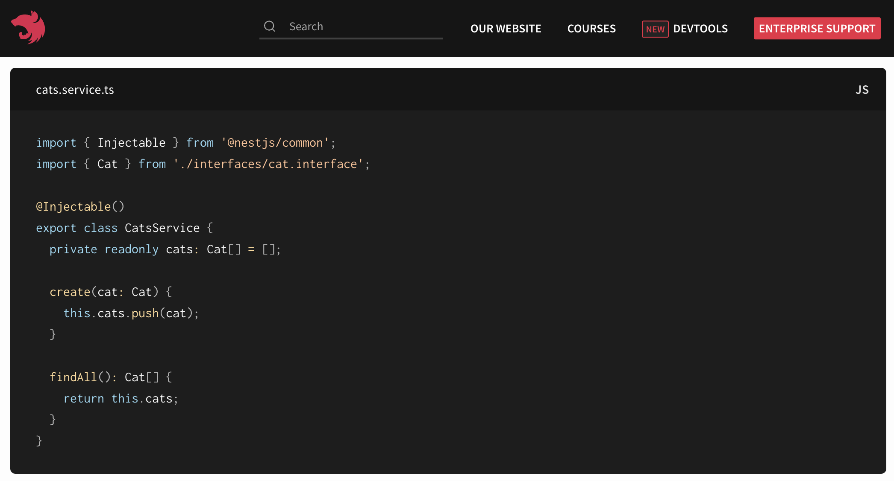
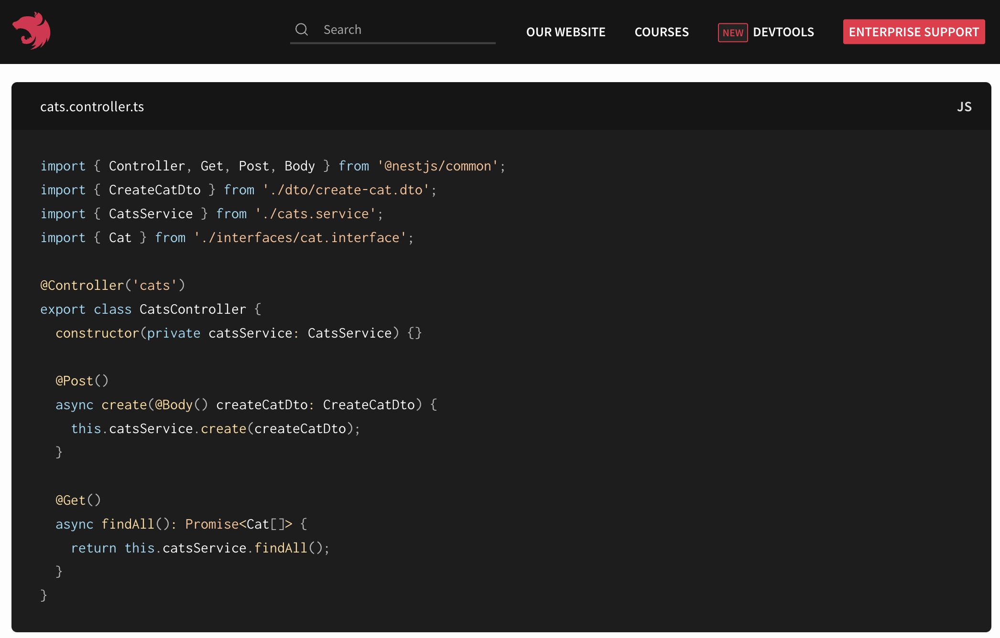

### 들어가며

나도 그랬지만, express만 다뤄보던 사람은 NestJS 등장하는 **의존성 주입**이나 **제어의 역전**과 같은 개념이 생소하게 느껴질 수 있다.
이들은 NestJS만의 고유한 개념은 아니고, 스프링과 같이 OOP를 추구하는 곳에서 볼 수 있는 개념이다.

 

### 의존성 주입이란?
의존성 주입에서의 의존성은 클래스 간의 의존성을 의미한다.
 클래스A가 클래스B의 변화에 영향을 받는다면, 클래스A가 클래스B에 의존성이 있다고 한다.
 만약 클래스A 내부에서 클래스B의 인스턴스를 직접 생성한다고 해보자, 그러면 클래스A는 클래스B의 변화에 민감해질 것이고, 두 클래스 간에 의존 관계가 생긴다.

이렇게 의존 관계가 생기면 유지보수성은 자연스레 떨어진다.
 특정 클래스가 변할 때, 변하는 클래스에 의존하고 있는 클래스들을 전부 수정해주어야하기 때문이다.
 이와 같은 문제를 야기하는 의존도 낮추기 위한 방법이 **의존성 주입**이다.

**의존성 주입**은 다른 클래스들이 의존하고 있는 클래스의 인스턴스를 외부에서 생성하여 필요한 곳에 주입하는 것을 말한다.
 NestJS에서 주입해야하는 클래스를 프로바이더라고 부르며, 프로바이더의 인스턴스는 IoC 컨테이너에서 관리하게 된다.

 

### 의존성 주입하기!
먼저, 주입할 테이블에 `@Injectable()` 데코레이터를 달아준다.
> 출처: https://docs.nestjs.com/providers#services
 
 Our `CatsService` is a basic class with one property and two methods.
The only new feature is that it uses the `@Injectable()` decorator.
The `@Injectable()` decorator attaches metadata,
which declares that `CatsService` is a class that can be managed by the Nest [IoC](https://en.wikipedia.org/wiki/Inversion_of_control) container.
  `CatsService`는 하나의 프로퍼티와 두 개의 메서드가 있는 기본 클래스입니다.
유일한 새로운 기능은 `@Injectable()` 데코레이터를 사용한다는 것입니다.
`@Injectable()` 데코레이터는 메타데이터를 첨부하여 `CatsService`가 Nest IoC 컨테이너에서 관리할 수 있는 클래스임을 선언합니다.

 

그다음 프로바이더를 사용할 클래스의 생성자에 프로바이더를 주입하면 된다.
> 출처: https://docs.nestjs.com/providers#services
 
 The `CatsService` is **injected** through the class constructor.
Notice the use of the `private` syntax.
This shorthand allows us to both declare and initialize the `catsService` member immediately in the same location.
  `CatsService`는 클래스 **생성자를 통해 주입**됩니다.
`private` 구문을 사용하는 것을 주목하세요.
이 축약어(private)를 사용하면 같은 위치(생성자)에서 `catsService` 멤버를 즉시 선언하고 초기화할 수 있습니다.

 

> 출처: https://docs.nestjs.com/providers#dependency-injection
  **Dependency injection (의존성 주입)**
  Nest is built around the strong design pattern commonly known as Dependency injection.
We recommend reading a great article about this concept in the official [Angular](https://angular.dev/guide/di) documentation.
  Nest는 일반적으로 의존성 주입이라고 알려진 강력한 디자인 패턴을 기반으로 구축되었습니다.
이 개념에 대한 자세한 내용은 [Angular](https://angular.dev/guide/di) 공식 문서에서 읽어보시기 바랍니다.
  In Nest, thanks to TypeScript capabilities,
it's extremely easy to manage dependencies because they are resolved just by type.
In the example below, Nest will resolve the catsService by creating and returning an instance of CatsService
(or, in the normal case of a singleton, returning the existing instance if it has already been requested elsewhere).
  Nest에서는 타입스크립트 기능 덕분에 종속성을 타입으로만 해결하기 때문에 종속성을 매우 쉽게 관리할 수 있습니다.
해당 예제에서 Nest는 CatsService의 인스턴스를 생성하고 반환함으로써(또는 싱글톤의 일반적인 경우 - 다른 곳에서 이미 요청된 경우 - 기존 인스턴스를 반환함으로써) catsService를 해결합니다.

 

### 의존성 주입을 사용하는 이유

의존성 주입은 위에서도 계속 말했듯, 의존성, 즉 결합도를 낮춰 유지보수성과 확장성을을 높이기 위해 사용한다.
 의존성 주입에 대해 알아보다 보면 테스트 코드 짜기에도 좋다는 말이 많다.
 아직 테스트 코드를 짜보지 않아 그 유용함을 느끼지 못한게 아쉽다..
 테스트 코드도 얼른 해봐야겠다!

 

### 출처

> [(인프런 강의) NestJS REST API 백엔드 완전 정복 마스터 클래스 - Part 1 NestJS Core, 섹션 7. 의존성 주입 & 제어의 역전](https://kotlinworld.com/64)
 [의존성 주입이란 무엇이며 왜 필요한가?](https://kotlinworld.com/64)