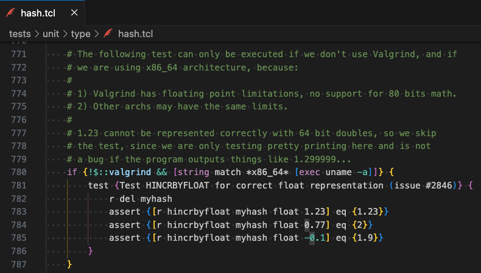

### 진행 환경


### Redis 빌드
> Redis 리포지토리 : https://github.com/redis/redis

```
git clone https://github.com/redis/redis
```
```
cd redis
```
```
make
```

### Redis 테스트
```
make test
```
- 빌드를 완료하면 `make test` 명령어를 통해 Redis의 자체 테스트를 실행

### Redis 테스트시 만난 에러
```
!!! WARNING The following tests failed:

*** [err]: Test HINCRBYFLOAT for correct float representation (issue #2846) in tests/unit/type/hash.tcl
Expected [r hincrbyfloat myhash float 1.23] eq {1.23} (context: type eval line 3 cmd {assert {[r hincrbyfloat myhash float 1.23] eq {1.23}}} proc ::test)
Cleanup: may take some time... OK
make[1]: *** [test] Error 1
make: *** [test] Error 2
```

- `tests/unit/type/hash.tcl` 의 `Test HINCRBYFLOAT for correct float representation (issue #2846)` 테스트가 실패
- 해당 테스트는 부동소수점 정밀도에 관한 테스트

### 에러 관련 이슈
> [Float formatting changed in unstable #2846](https://github.com/redis/redis/issues/2846)

> ["Test HINCRBYFLOAT for correct float representation" failing on non x86 architectures #3768](https://github.com/redis/redis/issues/3768)

> [redis make test fails on bash on windows #4537](https://github.com/redis/redis/issues/4537)

- CPU 아키텍처나 플랫폼마다 부동 소수점 정밀도가 달라질 수 있기 때문에, 해당 테스트는 x86이 아닌 플랫폼에서는 건너뛰도록 설계
- 그러나, Linux/x86_64과 크게 구분되지 않는 환경에서 스킵이 안되는 문제 발생
- 아래 명령어로 문제가 있는 테스트 개별 실행시에는 문제 없이 통과됨
  ```
  ./runtest --single unit/type/hash --only "Test HINCRBYFLOAT for correct float representation*"
  ```
- 가장 마지막 이슈는 해결되지 않은 채 open되어 있음


### Docker로 Linux 컨테이너 만들어 Redis 빌드 및 테스트

##### Linux 컨테이너 생성
```
docker run -itd --name <컨테이너 이름> ubuntu
```

##### Linux 컨테이너 접속 및 쉘 실행
```
docker exec -it <컨테이너 이름> sh
```

##### apt-get 업데이트
```
apt-get update
```

##### 필요한 패키지 install
```
apt-get install -y git && apt-get install -y make && apt-get install -y gcc && apt-get install -y pkg-config && apt-get install -y tclsh
```

##### Redis 빌드
```
make MALLOC=libc
```
- Linux 시스템에서는 jemalloc이 메모리 할당자의 기본값으로 사용된다. 하지만 Redis의 메모리 할당자를 jemalloc으로 하여 빌드하면, 이유는 모르겠지만 수많은 `warning`과 `error`를 마주할 수 있다. 이 상황을 회피하고 싶다면, 위 명령어를 통해 Redis 메모리 할당자를 강제로 libc malloc으로 설정할 수 있다.

##### Redis 테스트
```
make test
```