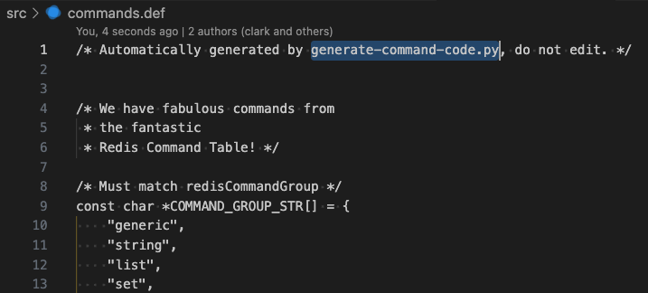

### 과제 내용
- 받은 내용을 그대로 돌려주는 `echo{영어이름}` 명령어를 추가해봅니다.
- Redis 명령은 `src/` 밑 commands로 시작하는 파일에 정의 되어 있습니다
  - `src/commands.h`, `src/commands.c`, `src/commands.def`
- 함수뿐만 아니라 함수 구현이 추가되어야합니다.

### 과제 힌트
- `commands.def`에 추가할 함수를 `echoCommand`를 참고해서 추가하고
- `server.c`에도 `echoCommand`를 참고해서 추가하면 됩니다.

<br />

### 과제 수행
#### commands.def

힌트에 언급된 `commands.def`을 보면 최상단 주석에 '`generate-command-code.py` 파일에 의해 자동적으로 생성되니 수정하지 말라'고 적혀있습니다. 명령어 정의 파일을 생성해주는 `utils/generate-command-code.py` 을 살펴보겠습니다.

<br />

#### generate-command-code.py

`Create all command objects` 라는 주석을 보았을 때, `src/commands/*.json` 로 부터 `commands.def` 파일을 생성한다는 것을 추측해볼 수 있습니다.

<br />

#### `src/commands/echo{영어이름}.json` 생성
기본 명령어인 `echo` 명령어 파일은 아래와 같습니다.
```json
{
    "ECHO": {
        "summary": "Returns the given string.",
        "complexity": "O(1)",
        "group": "connection",
        "since": "1.0.0",
        "arity": 2,
        "function": "echoCommand",
        "command_flags": [
            "LOADING",
            "STALE",
            "FAST"
        ],
        "acl_categories": [
            "CONNECTION"
        ],
        "reply_schema": {
            "description": "The given string",
            "type": "string"
        },
        "arguments": [
            {
                "name": "message",
                "type": "string"
            }
        ]
    }
}
```

echo와 같은 기능을 가지는, 이름만 다른 명령어 이므로 `echo.json`을 복사하여 `src/commands/echo{영어이름}.json`을 생성합니다. 명령어 키값과 `function` 부분을 변경해줍니다.
```json
{
    "ECHOJIWON": {
        "summary": "Returns the given string.",
        "complexity": "O(1)",
        "group": "connection",
        "since": "1.0.0",
        "arity": 2,
        "function": "echoJiwonCommand",
        "command_flags": [
            "LOADING",
            "STALE",
            "FAST"
        ],
        "acl_categories": [
            "CONNECTION"
        ],
        "reply_schema": {
            "description": "The given string",
            "type": "string"
        },
        "arguments": [
            {
                "name": "message",
                "type": "string"
            }
        ]
    }
}
```

<br />

#### `echo{영어이름}Command` 함수 구현
힌트에도 언급되고, `echo.json`의 `function`에서도 볼 수 있는 `echoCommand`를 검색해보면, `server.h`와 `server.c`에서 볼 수 있습니다.


echo와 같은 기능을 하는 명령어를 추가하는 것이므로 `echoCommand` 함수를 복제하여 이름만 `echo{영어이름}Command`로 바꿔줍니다.


<br />

### Redis 빌드 및 실행
##### Redis 빌드
```
make
```
##### Redis 실행
```
cd src
./redis-server
```
##### 다른 터미널에서 Redis command line interface 실행 및 명령어 입력
```
cd src
./redis-cli
```
```
> echo abc
> echoJiwon abc
```

