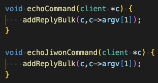

## 과제 내용
- [3주차 과제](http://localhost:8000/ossca-redis-2023-3-%EC%A3%BC%EC%B0%A8-%EA%B3%BC%EC%A0%9C/)를 심화 학습합니다.
- 받은 내용을 그대로 돌려주되, `echo{영어이름}_` 접두사를 붙여 응답하는 `echo{영어이름}` 명령어를 추가해봅니다.
- 즉, `echo{영어이름} abc` 라고 보내면, `echo{영어이름}_abc` 라고 응답이 오도록 해야합니다.

## 과제 힌트

- `client *c` 의 내부구조를 살펴봅니다.
  
- 다음 구조체와 함수들을 참고하세요.
  - `sds`, `sdsempty`, `sdscatfmt`, `addReplyBulkSds`

<br />

## 과제 수행
### client c*

<br/>

<details>
<summary>**client 구조체**</summary>
<div markdown="1">

```c
typedef struct client {
    uint64_t id;            /* Client incremental unique ID. */
    uint64_t flags;         /* Client flags: CLIENT_* macros. */
    connection *conn;
    int resp;               /* RESP protocol version. Can be 2 or 3. */
    redisDb *db;            /* Pointer to currently SELECTed DB. */
    robj *name;             /* As set by CLIENT SETNAME. */
    robj *lib_name;         /* The client library name as set by CLIENT SETINFO. */
    robj *lib_ver;          /* The client library version as set by CLIENT SETINFO. */
    sds querybuf;           /* Buffer we use to accumulate client queries. */
    size_t qb_pos;          /* The position we have read in querybuf. */
    size_t querybuf_peak;   /* Recent (100ms or more) peak of querybuf size. */
    int argc;               /* Num of arguments of current command. */
    robj **argv;            /* Arguments of current command. */
    int argv_len;           /* Size of argv array (may be more than argc) */
    int original_argc;      /* Num of arguments of original command if arguments were rewritten. */
    robj **original_argv;   /* Arguments of original command if arguments were rewritten. */
    size_t argv_len_sum;    /* Sum of lengths of objects in argv list. */
    struct redisCommand *cmd, *lastcmd;  /* Last command executed. */
    struct redisCommand *realcmd; /* The original command that was executed by the client,
                                     Used to update error stats in case the c->cmd was modified
                                     during the command invocation (like on GEOADD for example). */
    user *user;             /* User associated with this connection. If the
                               user is set to NULL the connection can do
                               anything (admin). */
    int reqtype;            /* Request protocol type: PROTO_REQ_* */
    int multibulklen;       /* Number of multi bulk arguments left to read. */
    long bulklen;           /* Length of bulk argument in multi bulk request. */
    list *reply;            /* List of reply objects to send to the client. */
    unsigned long long reply_bytes; /* Tot bytes of objects in reply list. */
    list *deferred_reply_errors;    /* Used for module thread safe contexts. */
    size_t sentlen;         /* Amount of bytes already sent in the current
                               buffer or object being sent. */
    time_t ctime;           /* Client creation time. */
    long duration;          /* Current command duration. Used for measuring latency of blocking/non-blocking cmds */
    int slot;               /* The slot the client is executing against. Set to -1 if no slot is being used */
    dictEntry *cur_script;  /* Cached pointer to the dictEntry of the script being executed. */
    time_t lastinteraction; /* Time of the last interaction, used for timeout */
    time_t obuf_soft_limit_reached_time;
    int authenticated;      /* Needed when the default user requires auth. */
    int replstate;          /* Replication state if this is a slave. */
    int repl_start_cmd_stream_on_ack; /* Install slave write handler on first ACK. */
    int repldbfd;           /* Replication DB file descriptor. */
    off_t repldboff;        /* Replication DB file offset. */
    off_t repldbsize;       /* Replication DB file size. */
    sds replpreamble;       /* Replication DB preamble. */
    long long read_reploff; /* Read replication offset if this is a master. */
    long long reploff;      /* Applied replication offset if this is a master. */
    long long repl_applied; /* Applied replication data count in querybuf, if this is a replica. */
    long long repl_ack_off; /* Replication ack offset, if this is a slave. */
    long long repl_aof_off; /* Replication AOF fsync ack offset, if this is a slave. */
    long long repl_ack_time;/* Replication ack time, if this is a slave. */
    long long repl_last_partial_write; /* The last time the server did a partial write from the RDB child pipe to this replica  */
    long long psync_initial_offset; /* FULLRESYNC reply offset other slaves
                                       copying this slave output buffer
                                       should use. */
    char replid[CONFIG_RUN_ID_SIZE+1]; /* Master replication ID (if master). */
    int slave_listening_port; /* As configured with: REPLCONF listening-port */
    char *slave_addr;       /* Optionally given by REPLCONF ip-address */
    int slave_capa;         /* Slave capabilities: SLAVE_CAPA_* bitwise OR. */
    int slave_req;          /* Slave requirements: SLAVE_REQ_* */
    multiState mstate;      /* MULTI/EXEC state */
    blockingState bstate;     /* blocking state */
    long long woff;         /* Last write global replication offset. */
    list *watched_keys;     /* Keys WATCHED for MULTI/EXEC CAS */
    dict *pubsub_channels;  /* channels a client is interested in (SUBSCRIBE) */
    dict *pubsub_patterns;  /* patterns a client is interested in (PSUBSCRIBE) */
    dict *pubsubshard_channels;  /* shard level channels a client is interested in (SSUBSCRIBE) */
    sds peerid;             /* Cached peer ID. */
    sds sockname;           /* Cached connection target address. */
    listNode *client_list_node; /* list node in client list */
    listNode *postponed_list_node; /* list node within the postponed list */
    listNode *pending_read_list_node; /* list node in clients pending read list */
    void *module_blocked_client; /* Pointer to the RedisModuleBlockedClient associated with this
                                  * client. This is set in case of module authentication before the
                                  * unblocked client is reprocessed to handle reply callbacks. */
    void *module_auth_ctx; /* Ongoing / attempted module based auth callback's ctx.
                            * This is only tracked within the context of the command attempting
                            * authentication. If not NULL, it means module auth is in progress. */
    RedisModuleUserChangedFunc auth_callback; /* Module callback to execute
                                               * when the authenticated user
                                               * changes. */
    void *auth_callback_privdata; /* Private data that is passed when the auth
                                   * changed callback is executed. Opaque for
                                   * Redis Core. */
    void *auth_module;      /* The module that owns the callback, which is used
                             * to disconnect the client if the module is
                             * unloaded for cleanup. Opaque for Redis Core.*/

    /* If this client is in tracking mode and this field is non zero,
     * invalidation messages for keys fetched by this client will be sent to
     * the specified client ID. */
    uint64_t client_tracking_redirection;
    rax *client_tracking_prefixes; /* A dictionary of prefixes we are already
                                      subscribed to in BCAST mode, in the
                                      context of client side caching. */
    /* In updateClientMemoryUsage() we track the memory usage of
     * each client and add it to the sum of all the clients of a given type,
     * however we need to remember what was the old contribution of each
     * client, and in which category the client was, in order to remove it
     * before adding it the new value. */
    size_t last_memory_usage;
    int last_memory_type;

    listNode *mem_usage_bucket_node;
    clientMemUsageBucket *mem_usage_bucket;

    listNode *ref_repl_buf_node; /* Referenced node of replication buffer blocks,
                                  * see the definition of replBufBlock. */
    size_t ref_block_pos;        /* Access position of referenced buffer block,
                                  * i.e. the next offset to send. */

    /* list node in clients_pending_write list */
    listNode clients_pending_write_node;
    /* Response buffer */
    size_t buf_peak; /* Peak used size of buffer in last 5 sec interval. */
    mstime_t buf_peak_last_reset_time; /* keeps the last time the buffer peak value was reset */
    int bufpos;
    size_t buf_usable_size; /* Usable size of buffer. */
    char *buf;
#ifdef LOG_REQ_RES
    clientReqResInfo reqres;
#endif
} client;
```

</div>
</details>

`echo` 명령어 구현에 사용하는 client 구조체의 `argv` 는 다음과 같다. 
```c
typedef struct client {
    // ...
    robj **argv;            /* Arguments of current command. */
    // ...
}
```
`argv[0]` 은 echo, `argv[1]` 는 `echo` 명령어 뒤에 따라오는 인자를 의미한다.

```c
typedef struct redisObject robj;
```
```c
struct redisObject {
    unsigned type:4;
    unsigned encoding:4;
    unsigned lru:LRU_BITS; /* LRU time (relative to global lru_clock) or
                            * LFU data (least significant 8 bits frequency
                            * and most significant 16 bits access time). */
    int refcount;
    void *ptr;
};
```
`echo` 명령어 인자의 **원본 문자열**은 `robj` 의 `ptr`에 저장되어 있을 것이다. 
그렇다면, 출력되는 문자열을 변형하고 싶을 땐 `argv[1]->ptr` 을 조작하면 된다!

<br />

### 문자열 조작하기
#### sds
```c
typedef char *sds;
```
`sds` 는 `char *`를 다른 이름으로 정의한 데이터 형식

<br/>

#### sdsempty
```c
/* Create an empty (zero length) sds string. Even in this case the string
 * always has an implicit null term. */
sds sdsempty(void) {
    return sdsnewlen("",0);
}
```
길이가 0인 문자열을 생성하는 함수

<br/>

#### sdscatfmt

```c
sds sdscatfmt(sds s, char const *fmt, ...);
```

<details>
<summary>**sdscatfmt 함수 구현부**</summary>
<div markdown="1">

```c
/* This function is similar to sdscatprintf, but much faster as it does
 * not rely on sprintf() family functions implemented by the libc that
 * are often very slow. Moreover directly handling the sds string as
 * new data is concatenated provides a performance improvement.
 *
 * However this function only handles an incompatible subset of printf-alike
 * format specifiers:
 *
 * %s - C String
 * %S - SDS string
 * %i - signed int
 * %I - 64 bit signed integer (long long, int64_t)
 * %u - unsigned int
 * %U - 64 bit unsigned integer (unsigned long long, uint64_t)
 * %% - Verbatim "%" character.
 */
sds sdscatfmt(sds s, char const *fmt, ...) {
    size_t initlen = sdslen(s);
    const char *f = fmt;
    long i;
    va_list ap;

    /* To avoid continuous reallocations, let's start with a buffer that
     * can hold at least two times the format string itself. It's not the
     * best heuristic but seems to work in practice. */
    s = sdsMakeRoomFor(s, strlen(fmt)*2);
    va_start(ap,fmt);
    f = fmt;    /* Next format specifier byte to process. */
    i = initlen; /* Position of the next byte to write to dest str. */
    while(*f) {
        char next, *str;
        size_t l;
        long long num;
        unsigned long long unum;

        /* Make sure there is always space for at least 1 char. */
        if (sdsavail(s)==0) {
            s = sdsMakeRoomFor(s,1);
        }

        switch(*f) {
        case '%':
            next = *(f+1);
            if (next == '\0') break;
            f++;
            switch(next) {
            case 's':
            case 'S':
                str = va_arg(ap,char*);
                l = (next == 's') ? strlen(str) : sdslen(str);
                if (sdsavail(s) < l) {
                    s = sdsMakeRoomFor(s,l);
                }
                memcpy(s+i,str,l);
                sdsinclen(s,l);
                i += l;
                break;
            case 'i':
            case 'I':
                if (next == 'i')
                    num = va_arg(ap,int);
                else
                    num = va_arg(ap,long long);
                {
                    char buf[LONG_STR_SIZE];
                    l = ll2string(buf,sizeof(buf),num);
                    if (sdsavail(s) < l) {
                        s = sdsMakeRoomFor(s,l);
                    }
                    memcpy(s+i,buf,l);
                    sdsinclen(s,l);
                    i += l;
                }
                break;
            case 'u':
            case 'U':
                if (next == 'u')
                    unum = va_arg(ap,unsigned int);
                else
                    unum = va_arg(ap,unsigned long long);
                {
                    char buf[LONG_STR_SIZE];
                    l = ull2string(buf,sizeof(buf),unum);
                    if (sdsavail(s) < l) {
                        s = sdsMakeRoomFor(s,l);
                    }
                    memcpy(s+i,buf,l);
                    sdsinclen(s,l);
                    i += l;
                }
                break;
            default: /* Handle %% and generally %<unknown>. */
                s[i++] = next;
                sdsinclen(s,1);
                break;
            }
            break;
        default:
            s[i++] = *f;
            sdsinclen(s,1);
            break;
        }
        f++;
    }
    va_end(ap);

    /* Add null-term */
    s[i] = '\0';
    return s;
}
```

</div>
</details>

형식 지정자를 지원하는 문자열 조작(연결) 함수

<details>
<summary>**sdscatfmt 함수 사용 예제**</summary>
<div markdown="1">


</div>
</details>

<br/>

#### `c->argv[1]->ptr`
```c
c->argv[1]->ptr = sdscatfmt(sdsempty(), "echoJiwon_%S", c->argv[1]->ptr);
```
`sdscatfmt` 함수와 `sdsempty` 함수를 활용하여 `c->argv[1]->ptr` 에 저장된 문자열을 조작할 수 있다

<br />

### 최종


<br />

### Redis 빌드 및 실행
##### Redis 빌드
```
make
```
##### Redis 실행
```
cd src
./redis-server
```
##### 다른 터미널에서 Redis command line interface 실행 및 명령어 입력
```
cd src
./redis-cli
```
```
> echo abc
> echoJiwon abc
```

