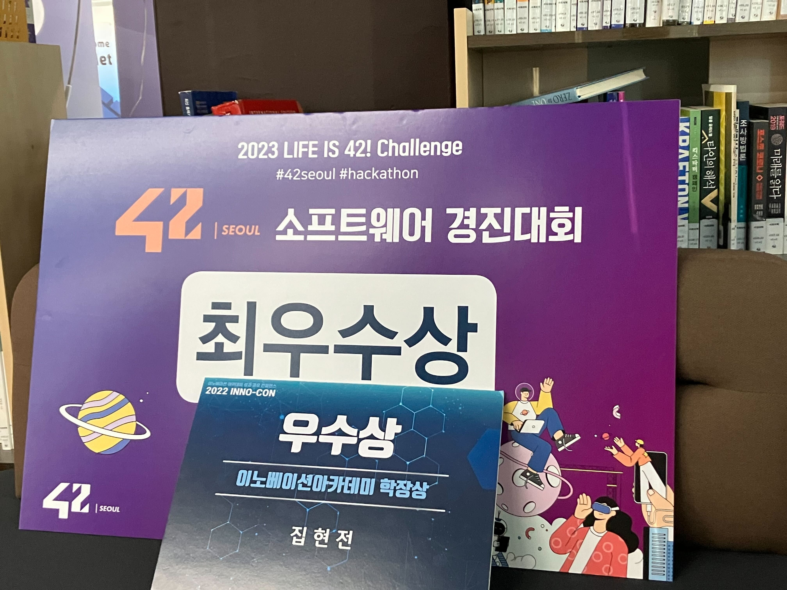
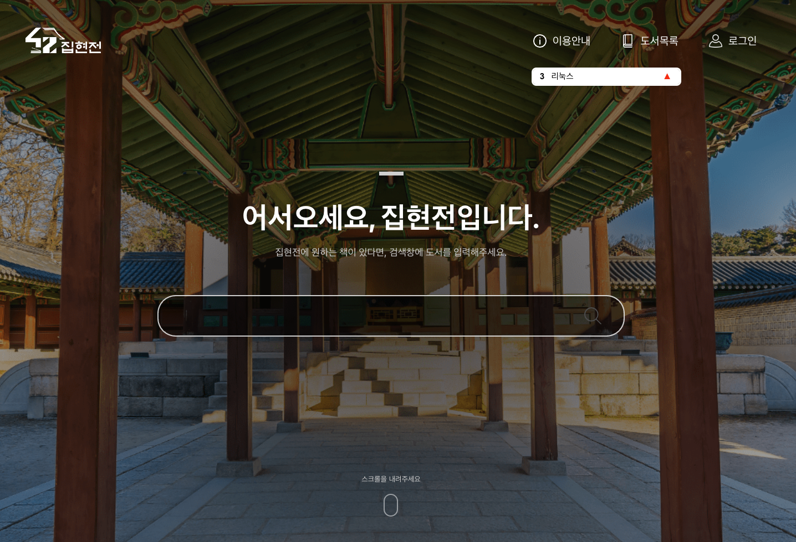
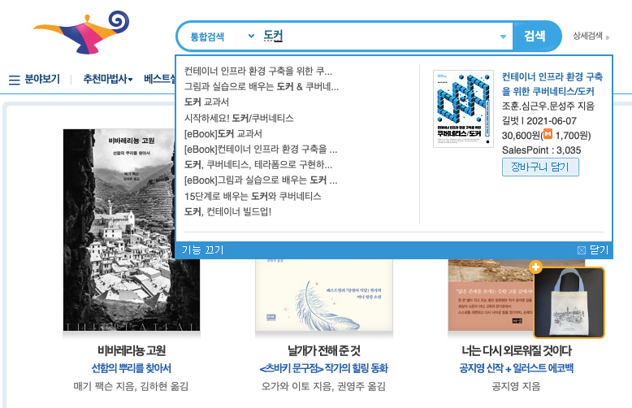
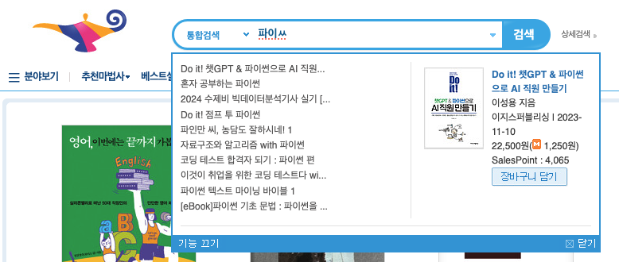
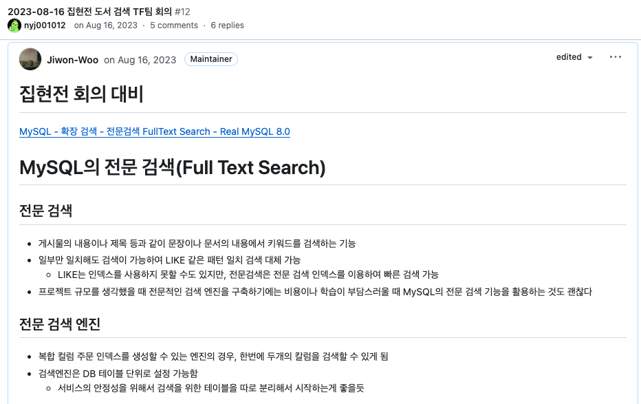

2023년 8월부터 9월까지 4주간 참여했던 42서울 소프트웨어 경진대회에서 최우수상을 수상했다. 
특히 나의 첫 웹 프로젝트인 도서관 웹 서비스를 개선하는 프로젝트로 참여했던 터라 더욱 뜻깊다. 
수상한 것도 물론 좋지만, 애정을 갖고 있는 서비스에 기여할 수 있다는 것은 기분 좋은 일이다.

 

## 소개

먼저, [도서관 웹 서비스](https://42library.kr)가 무엇인지 소개하려고 한다.

42서울에는 1000종 정도의 도서를 보유하고 있는 작은 도서관이 있다. 
이 도서관은 42서울의 도서관 동아리 부원들, 즉 42서울 교육생이 자체적으로 운영하고 있다. 

원래는 '에어테이블'이라는 외부 서비스를 사용해서 도서 관리를 했지만, 한계가 느껴졌다. 
그래, 나름 개발 공부하는 사람들인데, 도서 예약 기능, 도서 등록 기능, 사용자 연체 관리 기능 다 넣어서 구현해보자! 하고 나온 것이 이 서비스이다.

소프트웨어 경진대회 기간을 기준으로 600명 내외의 가입자, 1,700건의 대출, 100건의 예약 기록이 누적되었고,
2022년 하반기 구글 애널리틱스는 1,500뷰, 2023년 상반기는 2,200뷰를 달성했다.

 

## 소프트웨어 경진대회 주제 정하기

42서울에서 소프트웨어 경진대회가 열린다는 소식이 들렸다. 
심지어 기존에 운영하던 서비스를 개선시키거나 기능 추가하는 것도 가능하다니, 도서관 웹 서비스로 참여하기 딱이다 싶었다. 
도서관 동아리 내부에서도 어떤 주제를 가지고 참여할지 얘기가 갈렸지만, **검색**이라는 키워드가 귀에 딱 꽂혔다. 
검색 기능 고도화..! 재밌을 거 같아서 바로 참여 의사를 표했다.

 

## 기존 도서 검색 기능 분석하기

기존 도서 검색은 단순하게 사용자가 입력한 검색어를 완전히 포함하고 있는 도서들만 보여주었다. 
SQL LIKE `%{검색어}%` 패턴 매칭을 통한 검색을 했기 때문이었다.

> 검색어가 유사한 경우에도 검색 결과가 매우 다르다 
**ex) '자바스크립트' vs '자바 스크립트'**

보유하고 있는 도서가 1000종 정도 밖에 안되는데 검색까지 유연하지 않다면, 사용자가 원하는 정보를 얻기 힘들고, 웹 서비스나 도서관 방문률이 떨어질 수도 있다... 

**검색어를 일부만 포함**한 도서도 결과에 나오게 하고, 도서명/저자명/출판사명 간에 **복합 검색**도 가능하게 해서 사용자가 최대한 많은 검색 결과를 봤으면 좋겠다고 의견을 모았다.

추가로 엔터를 쳐서 도서 검색을 하기 전까지 검색 결과를 예측할 수 없다는 것도 문제로 꼽았다. 
검색 결과가 0개인 경우에도 검색하기 전까지 모르는 것이다. 

교보문고나 알라딘과 같은 도서 쇼핑몰처럼 검색어 타이핑 도중에도 **도서 미리보기**를 제공하면 좋을 것 같았다.

타이핑 도중 보유 도서 미리보기를 제공하게 된다면, 좀 더 연속성 있는 미리보기를 제공하고 싶었고, 이를 위해 **자음 모음 분리 검색**의 도입도 검토하게 되었다. 
기존에는 자음과 모음이 결합된 글자로만 검색이 가능했지만, '파이ㅆ'이나 '파있'으로도 검색이 가능하게 하자는 것이었다.

 

### 기술 스택 선택하기

검색 기능을 고도화했다는 얘기를 했을 때 가장 많이 들은 말이 있다.

*'엘라스틱 서치 사용하셨나요?'*

검색 엔진이라고 하면 가장 먼저 떠오르는 기술인 만큼, 우리도 고려하지 않은 것은 아니다. 

하지만 1000종 정도밖에 되지 않는 도서 검색을 위해 전문 검색 엔진을 도입하는 것이 맞을까란 생각이 들었다. 
심지어 동아리 내에서 운영 중인 서비스 특성상, 개발팀원이 자주 바뀌고, 웹 서비스를 한 번도 구현해보지 않은 팀원과 함께 할 수도 있다. 
이런 상황에서 엘라스틱 서치를 추가로 사용하면 서비스의 복잡도를 높여 유지보수를 어렵게 할 것이다. 
비용에 비해 효용이 아쉽다는 판단이 들어 다른 방법을 찾아보기로 했다.

그러다 찾게 된 것이 **MySQL 전문 검색** 이었다. 
full text 인덱스를 추가하고, 검색 쿼리만 수정하면 바로 적용할 수 있었다. 
심지어 전문 검색은 **검색어 부분 일치 검색**이 가능하고, 복합 인덱스 설정시 **복합 칼럼 검색**도 가능했다. 

구현하고자 했던 기능을 구현하는데 부족함이 없었고, 서비스의 규모에 맞는 기술이라는 생각이 들었다. 

 

## 구현 방법
full text 인덱싱 알고리즘은 텍스트를 n글자로 쪼깨 인덱싱하는 **n-gram** 분석 알고리즘을 사용했다. 
만약 'abcd'를 2글자씩 인덱싱 한다면 'ab', 'bc', 'cd' 가 각각 인덱싱 된다. 

(한글 형태소 분석 알고리즘도 있다고 들었지만, 비용이 많이 들기 때문에 범용적으로 쓰이는 n-gram 분석을 추천한다는 참고 도서의 말을 따르기로 했다.)

그리고 자음 모음 분리 검색을 위해 검색 필드인 도서명, 저자명, 출판사명의 자음과 모음을 분해하여 새로운 컬럼에 저장했다. 

그 다음 도서명, 저자명, 출판사명 컬럼에 **full text 인덱스**를 걸었는데, 해당 필드 간의 복합 검색을 원했기 때문에 특별히 **복합 인덱스**로 설정했다. 
예를 들어, '김영한 자바'라고 검색하면 저자명에 '김영한', 도서명에 '자바'를 포함한 도서를 검색할 수 있다.

 

## **검색 기능 개선 결과**

> **'자바스크립트' vs '자바 스크립트'** 
특히 ‘자바 스크립트’의 경우, 전문 검색에 의해 ‘자바’나 ‘스크립트’ 둘 중 하나만 포함해도 검색 결과에 반환됨

> **도서명 + 저자명 + 출판사명 복합 검색 가능**

> **자모 분리 검색 가능**

 
 

## 회고

이번 경진대회는 여러 의미로 나에게 도전이었다. 
소프트웨어 개발 대회를 나간 것도 처음이었고, 어떻게 구현하면 되겠다라는 명확한 그림 없이 무작정 도전하게 된 것도 지금 생각해보면 신기하다. 
어떻게든 문제를 해결할 방법은 있구나, 다시 한번 느꼈다.

그리고 경진대회 발표 리허설 때만해도 예정에 없었는데, 발표 당일 검색 기능 설명과 함께 서비스 시연을 맡게 되었다. 
오랜만의 발표라 많이 떨려서 떨림을 진정시키기 위해 연습에 몰두하기도 했다. 
하지만 나는 내 생각보다 발표를 잘해주었고, 스스로를 좀 더 믿는 계기가 되어 기뻤다. 

개발을 처음 시작했을 때 즐거웠던 감정도 들고 좋은 경험이었다. 
앞으로 이 블로그에서 해당 프로젝트에서 사용한 기술들을 플어가보고 싶다.
